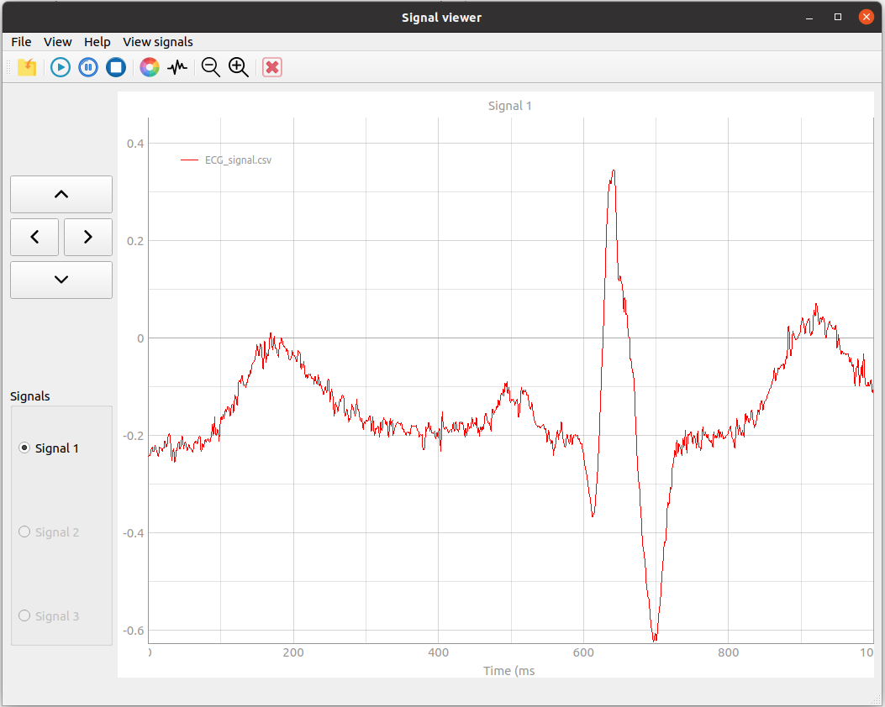

#Signal viewer
----
###### Run `main.py` to run the GUI

* The software visualize dynamic signal with format (.csv).

 

* The software have 3 channels to view different signals at the same time.

 

* The user can play the signal as cine with play, pause and stop buttons to control that
 

* for static or paused signal the user can Zoom-in, Zoom-out and scroll through the signal.

 

* The software can visualize the spectrogram of the signal

 

* The user can save the viewed signals as pdf file.

 

* The software is coded using **Python** and **pyqt5** package for GUI.
