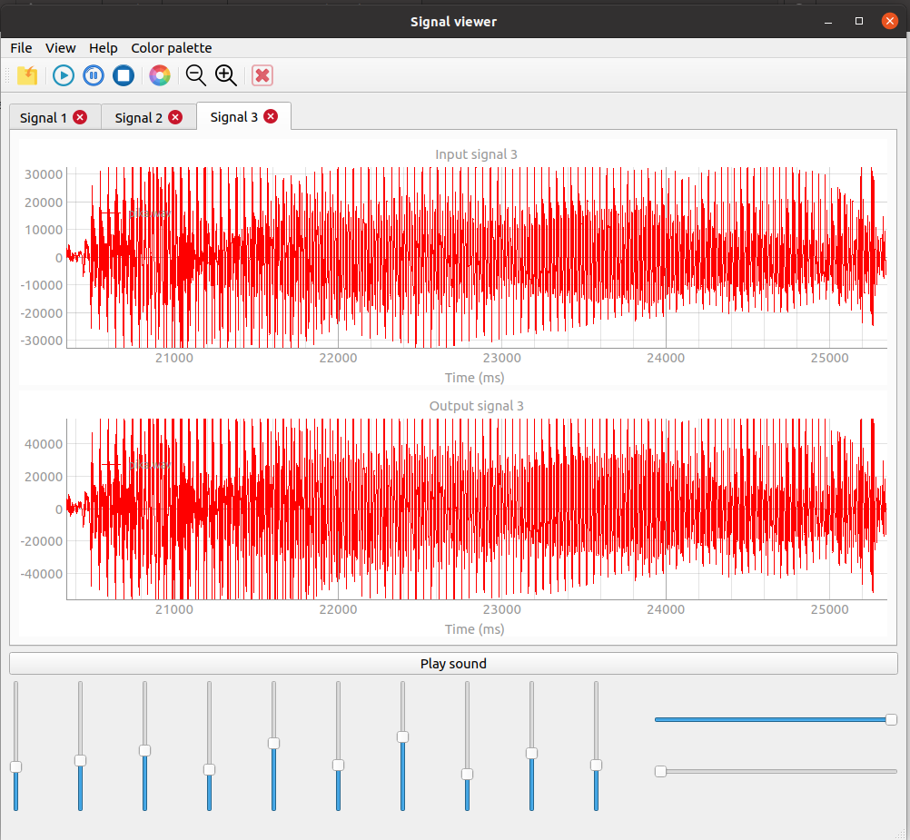
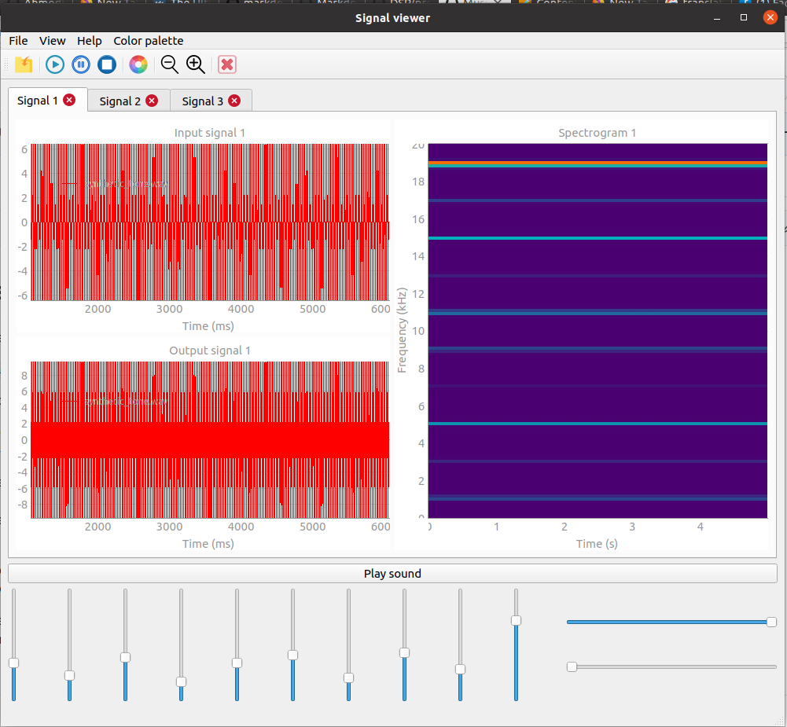

# Sound equlizer
------
##### Run `main.py` to run the GUI
###### Sound equalizer is a basic tool in the music industry. It also serves in several biomedical applications like hearing aid industry.
* The equlizer have 10 qualizer bands, each control the gain of 1/10 of the bandwidth of the frequency domain. The default value of each slider is 1.
* The user can view the original audio signal and the output signal after equlization and save the signal graph as pdf.
* The user can play the signal graph as cine with play, pause, stop, Zoom-in, Zoom-out and scroll buttons to control that
* The software is multiple document. The user can open multiple tabs at the same time to open diffrent files.

 
* The equlizer save the new settings automatically so when the user open the file again the sliders will be adjusted automatically.

* The user can play the audio inside the software by using play button.
* the user can view a spectrogarm of the audio file with 5 different color palettes to use. The user can determin the range of spectrogram by using spectrogram sliders.

 

* The software is coded using **Python** and **pyqt5** package for GUI.
