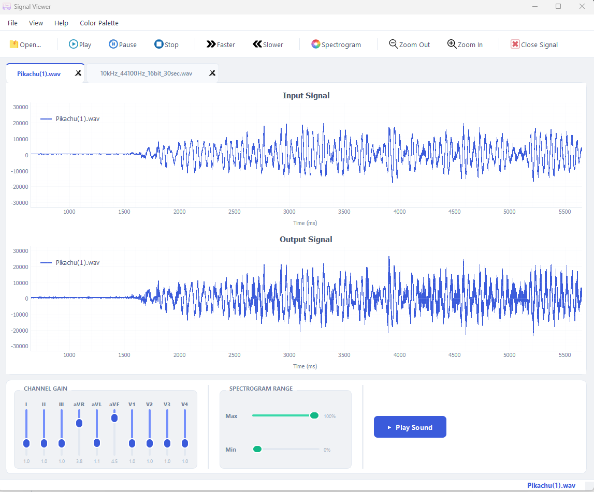
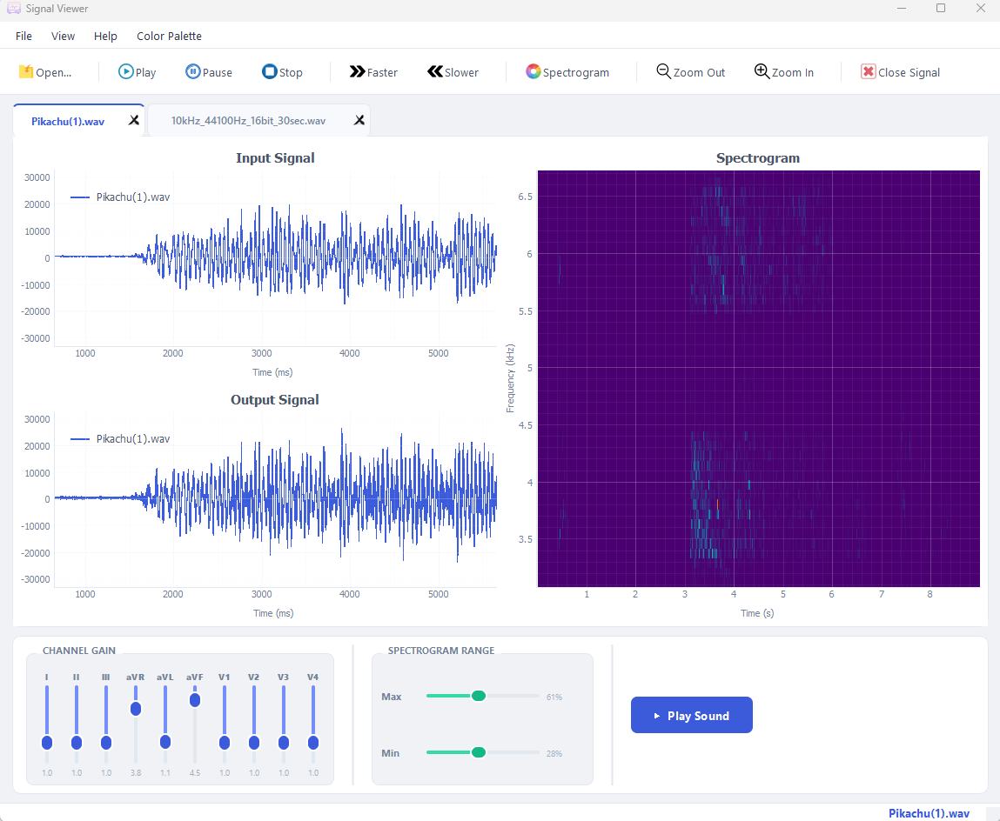

# Sound Equalizer

A multi-document desktop application for real-time audio equalization and visualization, built with **Python** and **PyQt5**. The equalizer splits the frequency spectrum into **10 bands**, each with its own gain control, and lets users play, visualize, and analyze audio signals before and after equalization.



## Features

### Equalization
- **10 equalizer bands**, each controlling the gain of 1/10 of the frequency-domain bandwidth.
- Each slider defaults to a gain of 1 (no change).
- **Settings persist per file** — reopening a file automatically restores its slider positions.

### Audio & Visualization
- **Audio playback** of the signal directly inside the app.
- View both the **original** and **equalized output** signals, and export the signal graph as a **PDF**.
- **Cine playback** of the signal graph with play, pause, stop, zoom-in, zoom-out, and scroll controls.

### Spectrogram
- View a **spectrogram** of the audio file.
- Choose from **5 color palettes**.
- Adjust the displayed spectrogram range using dedicated sliders.

### Multi-Document Interface
- Open **multiple files in separate tabs** and work with them simultaneously.



<br />

## Tech Stack

| Component   | Technology |
|-------------|------------|
| Language    | Python     |
| GUI         | PyQt5      |

## Getting Started

### Prerequisites
- Python 3.x

### Setup
1. Clone the repository:
   ```bash
   git clone https://github.com/ahmedelbadawy/DSP.git
   cd DSP/project2-Sound_equlizer
   ```
2. Install dependencies:
   ```bash
   pip install -r requirements.txt
   ```
3. Run the application:
   ```bash
   python main.py
   ```

## Usage
1. Open one or more audio files (each opens in its own tab).
2. Adjust the 10 equalizer band sliders to shape the audio; settings are saved automatically.
3. Play the audio, or use cine playback to animate the original and equalized signal graphs.
4. Open the spectrogram view to inspect frequency content, switching palettes and adjusting the range as needed.
5. Export the signal graph to PDF when you want to save your results.

